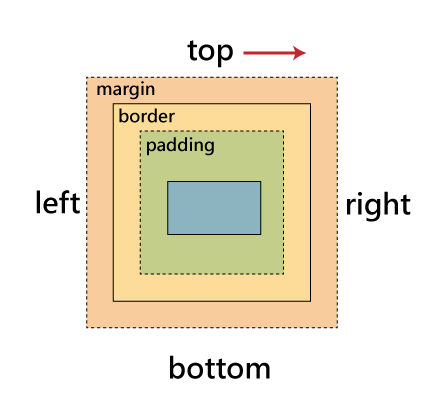

# CSS 筆記

## 介紹

CSS 為 **C**ascading **S**tyle **S**heets 的縮寫，它定義了 HTML 的 Style，描述網頁中元件該如何被呈現。

## 語法

CSS 由選擇器(Selector)後面跟著一個描述區塊(Declaration Block)組成。

-   選擇器(Selector)：用來選擇要套用 Style 的 HTML 元件，利用元件的 Class、Id 或標籤名稱來選取。
-   描述區塊(Declaration Block)：跟在選擇器後面，用大括號包裹，由 Style 的屬性(Property)及值(Value)所組成。屬性及值中間以分號連結成對，而各對之間則以分號區隔。
    -   屬性：元件所具有的要素，如 margin、padding、border、background...等等。
    -   值：可能為大小、顏色、樣式...等等，若一個屬性可以有多個值，值之間以空格做區分，值與其單位之間**不**加空格。

例：

```css
/* 選擇器 { 描述區塊 } */
p {
    /* 屬性：值 */
    color: blue;
    display: inline;
    width: 300px;
    border: 1px solid red;
    margin: 20px auto 0;
}
```

## 使用 CSS

在 HTML 中使用 CSS 有 3 種方式，外部 CSS(External CSS)、內部 CSS(Internal CSS)、行內 CSS(Inline CSS
)，若屬性之間相互衝突，其優先權為行內＞內部＞外部。

-   外部 CSS(External CSS): 在`<head></head>`中使用`<link rel="stylesheet" type="text/css" href="myCSS.css">` 來將 CSS 套用至頁面。
-   內部 CSS(Internal CSS): 直接將 CSS 定義在`<head></head>`裡的`<style></style>`標籤之中。例：
    ```html
    <head>
        <style>
            body {
                background-color: linen;
            }
            h1 {
                color: maroon;
                margin-left: 40px;
            }
        </style>
    </head>
    ```
-   行內 CSS(Inline CSS):將 CSS 定義在元件本身的 style attribute 之中。例：

    ```html
    <h1 style="color:blue;text-align:center;">This is a title.</h1>
    ```

## 選擇器(Selector)

CSS 利用元件的名稱、Class 或 Id 來選擇要套用樣式的元件。

-   名稱：直接利用 Html 標籤的名稱來選擇要套用樣式的元件。
 例如：

    ```css
    h1 {
        padding: 1em;
    }
    ```

-   Class：許多元件可以同屬一個 Class，利用 “ . ” 後面加上 Class 名稱來表示要設定的 Class 名稱，並在 Html 中利用 class attribute 來指定元件要套用的 CSS。例如：

    ```css
    .round-button {
        border-radius: 10px;
    }
    ```

    ```html
    <button class="round-button">round button</button>
    ```

-   Id : 與 Class 不同的是一個 Html 頁面中元件的 Id 必須是唯一的，彼此不能重複，利用 ” # ” 後面加上 Id 名稱來指定 Id 要套用的樣式，並在 Html 中利用 id attribute 來表示要套用的元件。例如：

    ```css
    #unique-id {
        color: red;
    }
    ```

    ```html
    <button id="unique-id">special button</button>
    ```

## 組合選擇器

CSS 選擇器能透過幾種不同的組合方式來選擇特定的元件。

-   將選擇器相連接：將名稱和 class 相連或 class 與 class 相連來表示選擇同時符合條件的元件。例如：

    ```css
    .big.round {
        width: 1000px;
        border-radius: 200px;
    }
    ```

    ```html
    <button class="round big">big & round button</button>
    ```

-   將選擇器以空格分隔:選擇器之間以空格分隔表示在階層之下的元件(後代即可)。例如：

    ```css
    div p {
        background: #005696;
    } /* 選擇在 div 中的 p */
    ```

    ```html
    <div>
        <p>被選擇</p>
    </div>
    ```

    或是

    ```css
    .class1 .class2 {
        border: 1px solid balck;
    }
    ```

    ```html
    <div class="class1">
        <div class="middle-class">
            <!-- 為後代即可 -->
            <button class="class2">被選擇</button>
        </div>
    </div>
    ```

-   將選擇器以逗號相連：選擇器以逗號分隔表示各個選擇器所指定的元件皆套用樣式。例如：
    ```css
    th,
    td {
        padding: 5px;
    } /* th 與 td 皆有 padding 5px */
    ```
-   將選擇器以加號相連：選擇器以加號相連接表示緊接著的元件。例如：
    ```css
    div + p {
        background: yellow;
    }
    ```
    ```html
    <div>
        <h1></h1>
        <p>未被選擇</p>
    </div>
    <p>被選擇</p>
    <!-- 緊接著在 div 之後的 p 才會被選擇  -->
    ```

更多選擇器組合的方式可參閱：[CSS Selector Reference](https://www.w3schools.com/cssref/css_selectors.asp)

## Pseudo-classes 和 Pseudo-elements

-   Pseudo-classes(虛擬類別)用來選擇元件的特定狀態，例如：滑鼠在元件上、元件被點選...等。
    語法為在選擇器後接上單個冒號再加上欲選擇之狀態，如：

    ```css
    button:hover {
        background: red;
    }
    ```

    上段 CSS 將滑鼠在其上的按鈕背景設為紅色。
    還有其他類別，例如：active、checked、first-child、focus...等，更多類別請參考 [CSS Pseudo-classes](https://www.w3schools.com/css/css_pseudo_classes.asp)。

-   Pseudo-elements(虛擬元素)用來選擇元件的特定部分，目前有 5 個種類，分別為 after、before、first-line、first-letter、selection。
    語法為在選擇器後接上兩個冒號再加上欲選擇之部分，如：
    ```css
    h1::before {
        content: "SECTION";
    }
    ```
    上段 CSS 將在 h1 之前加上 "SECTION"。更多的使用方式請參考 [CSS Pseudo-elements](https://www.w3schools.com/css/css_pseudo_elements.asp)。

## 顏色

在 CSS 中可以利用許多方式表示顏色，常見都方式有直接使用名稱、rgb 函式、Hex color code (十六進制色碼表示法)。

-   顏色名稱：在 CSS 共有 [140 種](https://www.w3schools.com/colors/colors_names.asp)預先定義好的顏色名稱，例如：grey、lightgrey、red、skyblue ......等。
    ```css
    p {
        background: skyblue;
    }
    ```
-   rgb、rgba 函式：利用指定紅、綠、藍及透明度來表示顏色，0 為全無，255 為全滿，透明度 0 為透明，1 為不透明，rgba(0\~255,0\~255,0\~255,0\~1)。
    ```css
    p {
        background: rgba(120, 62, 33, 0.4);
    }
    ```
-   Hex color code：與 rgba 類似，以#開頭依序以兩碼 16 進制數字表示色碼，依序為紅、綠、藍及透明度，與 rgba 不同的是透明度範圍為 0\~255，例：#f5e15613。
 亦可將兩碼縮為一碼，若將兩碼縮為一碼，則會自動將其重複，所以有時候也能看到 3 碼或 4 碼的表示法，例：#345 = #334455、#b56e = #bb5566ee。
    ```css
    p {
        background: #784021;
    }
    ```

## 單位

CSS 單位分為兩種：絕對單位以及相對單位，單位與數值之間不能插入空格，若數值為 0，則可省略單位。

-   絕對單位：絕對單位為固定大小，如下：

    -   cm : 1 公分。
    -   mm : 1 毫米。
    -   in : 1 英吋(1in = 96px = 2.54cm)
    -   px : 1 像素(1px = 1/96th of 1in) **常用**
    -   pt : 1 磅(1pt = 1/72 of 1in)
    -   pc : 1 皮卡(1pc = 12 pt)

-   相對單位：相對單位的大小為根據其他大小計算而來，常見的如下：

    -   em : 相對於元件本身的字體大小，2em 為兩倍字體大小。
    -   rem : 相對於根元件(最外層的 html)的字體大小。
    -   vw : 相當於 1%的視窗“**寬度**”。
    -   vh : 相當於 1%的視窗“**高度**”。
    -   vmin : 相當於 1%的視窗高度與寬度中的最“**小**”值。
    -   vmax : 相當於 1%的視窗高度與寬度中的最“**大**”值。
    -   % : 相對於元件父元件的對應屬性百分比大小。

更多關於單位可以參照：[CSS Units](https://www.w3schools.com/cssref/css_units.asp)。

## 常用屬性

-   margin : 元件邊界與其他元件的距離，你可以使用 margin-top、margin-right、margin-bottom、margin-left，來指定 margin 的位置，你也可以直接使用 margin 賦予多個值來指定 margin。

    -   1 個值 : `{ margin : 10px; }` 表示 4 個方向 margin 皆為 10px。
    -   2 個值 : `{ margin : 10px 20px; }` 表示上下 margin 為 10px，左右 margin 為 20px。
    -   3 個值 : `{ margin : 10px 20px 30px; }` 表示上 margin 為 10px，左右 margin 為 20px，下 margin 為 30px。
    -   4 個值 : `{ margin : 10px 20px 30px 40px; }` 4 個值依序代表上、右、下、左 margin。

    若把 margin 值設定為 auto，表示要最大化 margin，將左右 margin 設為 auto 可以達到元件置中的效果。

    

-   padding : 表示元件邊界至其內容的距離，如上圖。如同 margin，padding 也能個別使用 padding-top、padding-right、padding-bottom、padding-left，來表示 padding 位置。不同數量的值對應方位也與 margin 相同。但是 padding 與 margin 不同，並不能使用 auto 來使內部元件置中。

-   border : 為元件的邊界，可以用 border-color、border-style、border-width、border-radius 來塑造邊界，也可以單純的使用 boder 簡短的指定寬度、樣式、顏色。

    -   border : `{ border : 1px solid red;}` 此為 border 簡短語法，數值依序表示寬度、樣式及顏色。
    -   border-color : 用來指定邊界的顏色，同樣可以利用多個值來指定不同方向之邊界。
    -   border-width : 用來指定邊界的寬度(粗細)，同樣可以利用多個值來指定不同方向之邊界。
    -   border-style : 用來指定邊界的樣式，同樣可以利用多個值來指定不同方向之邊界，有 dotted、dashed、solid、double...等等。
    -   border-radius : 用來指定邊界邊角的圓滑程度，同樣可以利用多個值來指定不同方向之邊界，邊界被削減得部分也同樣會使得元件形狀改變，可以利用`{border-radius : 100%;}`來創造一個圓形元件。
        多個值的表示方式為：
        -   4 個值 : 依序為左上、右上、右下、左下。
        -   3 個值 : 依序為左上、右上及左下、右下。
        -   2 個值 : 依序為左上及右下、右上及左下。
        -   1 個值 : 套用至 4 個角。

-   display :

## CSS 內建函式

CSS 提供一些內建的函式，如上面所提到 rgb() 就是其中一種，此外還有像是 calc() 可以用來計算數值，linear-gradient() 可以輸出漸層顏色， attr() 可以返回所選元件的某個 Html attribute。

```css
a:after {
    content: " (" attr(href) ")";
} /* 在超連結後面加上網址 */
#div1 {
    width: calc(100% - 100px);
} /* id 為 div1 的元件寬度為 100% - 100px */
```

## 動畫
